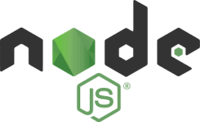
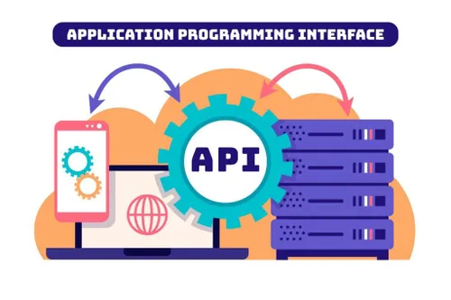

 # Backend (NodeJ.s), APIs e MySQL

# <font color="gren">**Node.Js**</font>



&nbsp; Node.js é essencialmente um ambiente de execução que utiliza o motor V8 do Google Chrome para executar JavaScript fora do navegador. Isso permite que os desenvolvedores criem aplicações rápidas e escaláveis sem depender da interface do navegador.

<hr>

### Principais Características

**Assincronismo**: Permite que múltiplas operações sejam realizadas simultaneamente, melhorando o desempenho.

**Escalabilidade**: Ideal para aplicações que precisam lidar com muitas conexões simultâneas.

**Uso do JavaScript**: Como utiliza JavaScript tanto no frontend quanto no backend, facilita a transição para desenvolvedores que já estão familiarizados com essa linguagem.

<hr>

### O Node possuí algumas vantagens como:

* Muito leve, pouco uso de memória ram, melhor aproveitamento da CPU;

* Ultiliza Javascript;

* Tem um dos maiores ecossistemas de bibliotecas, módulos e plug-ins do mundo.

<hr>
 
### Instalação e configuração

1. **Instalação do Node.js**: Baixe e instale o Node.js a partir do site oficial. Ele está disponível para Windows, macOS e Linux.

2. **Configuração do Ambiente de Desenvolvimento**:
Utilize um editor de código como o Visual Studio Code.

3. Configure um sistema de controle de versão, como o Git, para gerenciar seu código.

### Estrutura básica
```
npm init -y  # Inicializa um novo projeto Node.js
npm install express  # Instala o framework Express
```
<hr>

# <font color="blue">**APIs**</font>



&nbsp; APIs (Application Programming Interfaces) são conjuntos de definições e protocolos que permitem a comunicação entre diferentes sistemas de software. Elas desempenham um papel crucial no desenvolvimento de aplicações modernas, permitindo que diferentes serviços e plataformas interajam de maneira eficiente. Com a popularidade crescente do desenvolvimento web, especialmente utilizando Node.js, entender como criar e gerenciar APIs se tornou uma habilidade essencial para desenvolvedores.

## Por que APIs são importantes?

* Integração de Sistemas: Elas permitem que diferentes sistemas e aplicações se comuniquem entre si, facilitando a troca de dados.

* Reutilização de Funcionalidades: APIs permitem que funcionalidades existentes sejam reutilizadas em diferentes aplicações, economizando tempo e recursos.

* Escalabilidade: Com APIs bem projetadas, é possível escalar aplicações facilmente, adicionando novos serviços ou funcionalidades sem afetar o sistema existente.

## Criando APIs com Node.js

1. **Configuração do ambiente**

    &nbsp; Para começar, é necessário instalar o Node.js e configurar um projeto básico:

    ~~~
    mkdir minha-api

    cd minha-api

    npm init -y

    npm install express
    ~~~
<hr>

2. **Estrutura básica da API**

    &nbsp; Uma vez que o ambiente está configurado, você pode criar um servidor básico com Express:
    
    ```js
    const express = require('express');
    const app = express();
    const PORT = 3000;

    app.use(express.json()); // Middleware para parsear JSON

    app.get('/api', (req, res) => {
        res.json({ message: 'Bem-vindo à minha API!' });
    });

    app.listen(PORT, () => {
        console.log(`Servidor rodando na porta ${PORT}`);
    });
    ```

    <hr>

3. **Criando rotas e controladores**

    &nbsp; As rotas são essenciais para definir como a API responde a diferentes requisições. É importante seguir as práticas recomendadas de design de API:

    * Utilizar Verbos HTTP: GET para obter dados, POST para criar novos dados, PUT para atualizar e DELETE para remover.

    * Retornar Códigos de Status Adequados: Por exemplo, 200 para sucesso, 404 para não encontrado e 500 para erro interno do servidor.

## Boas práticas no desenvolvimento de APIs

* Documentação: Utilize ferramentas como Swagger ou Postman para documentar sua API.

* Validação de Dados: Implemente validação nos dados recebidos para evitar erros e garantir integridade.

* Segurança: Considere implementar autenticação (como JWT) e autorização nas suas rotas.
<hr>

>O desenvolvimento de APIs com Node.js é uma habilidade valiosa no cenário atual. Com a combinação do Node.js e Express, os desenvolvedores podem criar APIs robustas e escaláveis que atendem às necessidades modernas de integração e comunicação entre sistemas. Ao seguir boas práticas e explorar as vastas bibliotecas disponíveis no ecossistema Node.js, você pode construir soluções eficientes que potencializam suas aplicações.
<hr>

# Conexão MySQL

&nbsp; O desenvolvimento de APIs com Node.js é uma habilidade valiosa no cenário atual. Com a combinação do Node.js e Express, os desenvolvedores podem criar APIs robustas e escaláveis que atendem às necessidades modernas de integração e comunicação entre sistemas. Ao seguir boas práticas e explorar as vastas bibliotecas disponíveis no ecossistema Node.js, você pode construir soluções eficientes que potencializam suas aplicações.

## Conexão do MySQL e Node.js 

&nbsp; Conectar-se a um banco de dados MySQL usando Node.js é uma prática comum em desenvolvimento de aplicações web. A seguir, estão os passos e exemplos para realizar essa conexão.

## Instalação do MySQL e Node.js

1. Instalar o MySQL: Baixe e instale o MySQL Community Server a partir do site oficial.

2. Instalar o Node.js: Baixe a versão mais recente do Node.js e instale-a. Verifique a instalação executando node -v no terminal.

3. Instalar o Driver MySQL: O driver mais comum para conectar Node.js ao MySQL é o pacote mysql2. Você pode instalá-lo usando o seguinte comando:

    ```
    npm install mysql2
    ```

## Exemplo de conexão
```js
const mysql = require('mysql2');

// Configuração da conexão
const connection = mysql.createConnection({
  host: 'localhost',
  user: 'seu_usuario',
  password: 'sua_senha',
  database: 'seu_banco'
});

// Conectar ao banco de dados
connection.connect((err) => {
  if (err) {
    console.error('Erro ao conectar: ' + err.stack);
    return;
  }
  console.log('Conectado como ID ' + connection.threadId);
});
```

## Manipulação de Dados

&nbsp; Você também pode inserir, atualizar e excluir dados. Aqui está um exemplo de inserção:
```js
const novoUsuario = { nome: 'João', idade: 30 };

connection.query('INSERT INTO usuarios SET ?', novoUsuario, (error, results) => {
  if (error) throw error;
  console.log('Usuário inserido com ID:', results.insertId);
});
```